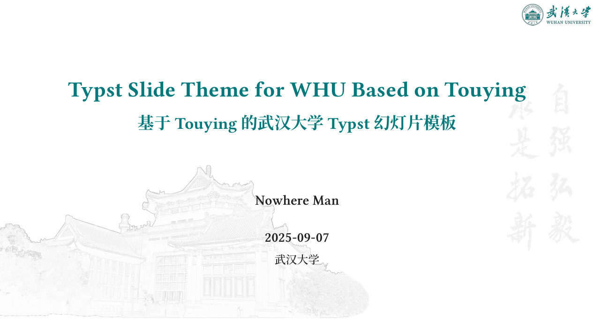

# 武汉大学 Touying 幻灯片主题 (Touying Slide Theme for WHU)

本模板基于[上海交通大学主题](https://github.com/tzhtaylor/touying-sjtu)进行修改。

所使用的标识来源于武汉大学公开的[标识文件](https://www.whu.edu.cn/info/1153/3232.htm)。

部分背景图来自[武汉大学 beamer 模板](https://github.com/hrtan99/WHU-Beamer)。

本模板基于 Touying [Dewdrop](https://github.com/touying-typ/touying/blob/main/themes/dewdrop.typ) 主题开发。



## 示例

查看 [示例](examples) 和 [Github Pages](https://hithereland.github.io/touying-whu/) 以获取更多详情。

你也可以自行编译示例文件：

```console
typst compile ./examples/main.typ --root .
```

生成的 PDF 文件位于 `./examples/main.pdf`。

## 免责声明

本模板为非官方模板，与武汉大学无直接关联。使用本模板时请遵守相关法律法规和学校规定。

## License

This project is licensed under the MIT License.
